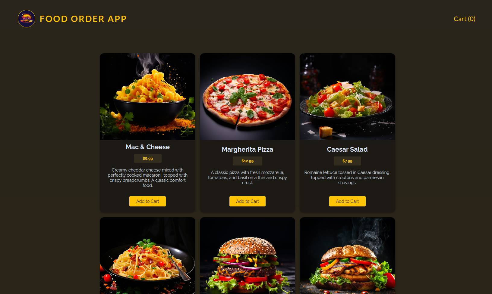
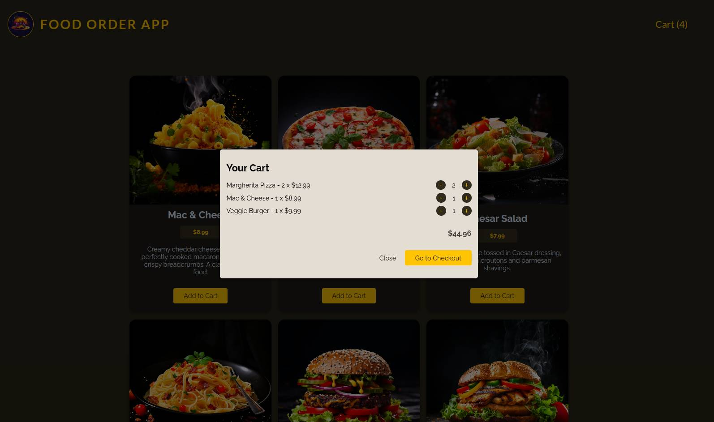
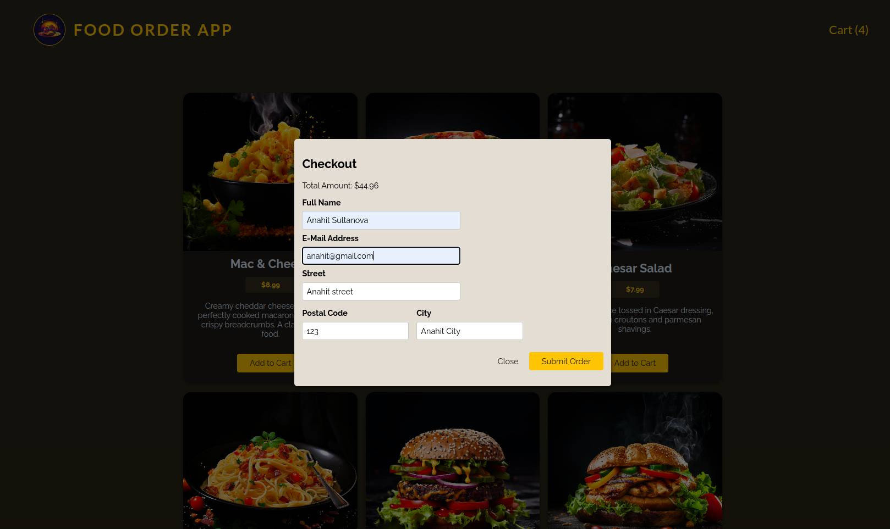

 <br/>
 <br/>
 <br/>

## Food Order Application
This app based on React JS. (React's Context API & useReducer, Custom Hook, ...)

## Install Frontend

```sh
npm install
```

```sh
npm dev
```

```sh
npm preview
```

## Install Backend

```sh
cd backend
```

```sh
npm install
```

```sh
npm start
```